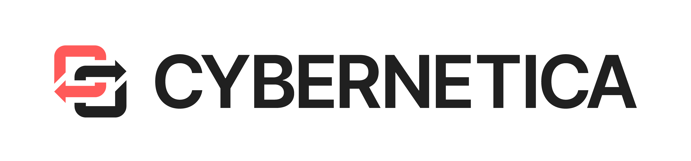
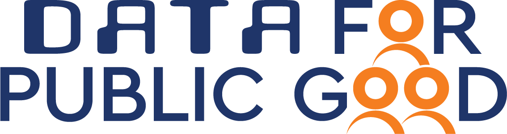

# Carbyne Stack Ecosystem

{ class="ecosystem-logo" }

[Robert Bosch GmbH][bosch] started the Carbyne Stack open source project in
September 2021 by contributing an internally developed code base, and now
maintains the project and contributes regularly. Carbyne Stack is used by Bosch
to conduct proof-of-concepts in multiple domains with various partners.

---

{ class="ecosystem-logo" }

[Cybernetica][cybernetica] is a research-driven technology company specializing
in secure data solutions. Leveraging over 15 years of experience deploying MPC,
they are modernizing their product, Sharemind MPC, by integrating it with
Carbyne Stack and following cloud-native design patterns. This integration will
unlock new possibilities for privacy-preserving data analysis and
collaboration, adding valuable capabilities to the Carbyne Stack ecosystem.
Cybernetica is also committed to simplify the process for others to integrate
their MPC runtimes into Carbyne Stack, ultimately positioning it as the go-to
platform for all MPC needs.

---

{ class="ecosystem-logo" }

The [Centre of Data for Public Good][cdpg] (CDPG) focuses on leveraging data
to address societal challenges. It serves as a hub for multidisciplinary
research, bringing together experts from academia, industry, and government to
harness the power of data to enhance public services and drive equitable
growth. With a focus on ethical data use, privacy, and responsible AI, the
centre aims to develop solutions that positively impact areas such as smart
cities, agriculture, logistics, geospatial, environmental sustainability, and
so on.

---

{ class="ecosystem-logo" }

The [Honda Research Institute Europe][hri] (HRI-EU) researches future
technologies advancing cooperative intelligent systems that will shape our
future in many ways, ranging from autonomous and accident-free driving to
personal robots and from smart design and manufacturing to the
privacy-preserving use of data. The privacy of users and customers is one of
HRI's essential goals, and they aim to live up to the trust of their customers.
HRI-EU contributes together with academic and innovative partners to Carbyne
Stack to implement this vision.

---

{ class="ecosystem-logo" }

[Resolve][resolve] is revolutionizing how data is applied in the advertising
ecosystem through Federated learning and Secure Multi-Party Computation (SMPC).
Resolve's approach leverages decentralized data processing and federated
learning, ensuring partners retain full control over their data while
benefiting from advanced insights and collaborative learning. Resolve utilizes
Carbyne Stack and SMPC as components to succeed with scalable private analytics
for secure aggregation in Federated Learning for the digital advertisement
ecosystem. Through their contributions, Resolve aims to enable a privacy-safe
ecosystem for digital advertising driven by cooperation, transparency, and
innovation.

---

{ class="ecosystem-logo" }

From quantum technologies and blockchain, to cryptofinance and beyond,
[SAP][sap] is continuously exploring new ideas, business models and pioneering
technologies to shape the next generation of enterprise software, deliver
real-world innovation, and enable sustainability. SAP Security Research is
using Carbyne Stack in the [Glaciation][glaciation] EU Horizon Europe publicly
funded project and additionally explores the potential of secure multi-party
computation for various use cases, that are currently limited by security and
privacy concerns. SAP contributes to Carbyne Stack in the areas of usability
and operations.

---

{ class="ecosystem-logo" }

University of Technology Sydney, Bosch, and Food Agility CRC have joined forces
to work on the publicly funded project [Collaborative privacy-preserving Digital
Agriculture][fa117]. One research track is focussing on Federated Learning with
MPC-based hardware-accelerated secure aggregation. The research results will
eventually be implemented by a UTS engineering team based on Carbyne Stack.

---

[bosch]: https://www.bosch.com
[cdpg]: https://dataforpublicgood.org.in
[cybernetica]: https://cyber.ee/
[fa117]: https://www.foodagility.com/research/protecting-data-in-digital-agriculture
[glaciation]: https://glaciation-project.eu/
[hri]: https://www.honda-ri.de/
[resolve]: https://resolve.tech/
[sap]: https://www.sap.com/
