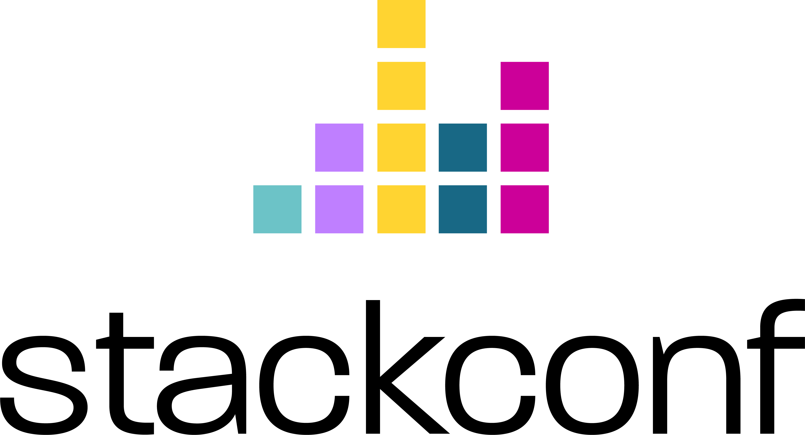

# Events featuring Carbyne Stack

## Upcoming Events

### [CarbyneStackCon '22][csc22]

{ class="event-logo" }

See the dedicated [event page][csc22] for detailed information about our
upcoming hybrid Carbyne Stack community gathering in Stuttgart.

---

## Past Events

### [StackConf '22][stackconf22]

Scaling the Grail - Cloud-Native Computing on
Encrypted Data using Carbyne Stack ([Contributed Talk][stackconf22-talk])

{ class="event-logo" }

JULY 19 – 20, 2022 | BERLIN (GERMANY)

!!! abstract

    Computing on Encrypted Data (CoED) is considered a holy grail of data
    security. A major roadblock for the adoption of CoEDs is a lack of
    integration with cloud technologies to enable scalable, resilient, and easy
    to operate deployments. The Carbyne Stack open-source project has set out to
    close this gap. This talk will take the audience down the rabbit hole of
    CoED technologies and explain how Carbyne Stack blends cloud-native
    technologies to solve the challenges of scaling sensitive workloads.

:material-video: [Recording](https://www.youtube.com/watch?v=0ELrWOaDZq8)

---

### [OSS-NA '22][ossna22]

Carbyne Stack - Cloud Native Computing on Encrypted
Data ([Contributed Talk][ossna22-talk])

{ class="event-logo" }

JUNE 21 - 24, 2022 | AUSTIN, TEXAS (US).

!!! abstract

    Data has become a strategic asset that is pooled with others for joint 
    processing, monetized on data platforms, and used to fuel the AI revolution.
    As the ability to leverage internal and external data is becoming a major
    factor for business success, protecting valuable data is more important than
    ever. Enter Computing On Encrypted Data technologies (COEDs). COEDs pave the
    way for strong end-to-end protection of data by enabling encryption in use.
    One roadblock for the wider adoption of COEDs so far has been the lack of
    integration with state-of-the-art cloud technology to enable scalable,
    resilient, and easy to operate COED deployments. The Carbyne Stack
    open-source project has set out to close this gap by lifting a specific COED
    technology called Secure Multiparty Computation (MPC) into the cloud. Sven
    will take the audience down the rabbit hole of COED technologies and explain
    how Carbyne Stack blends cloud-native technology (including Kubernetes,
    Istio, Knative, and others) to solve the specific challenges of deploying
    MPC in the cloud like cross-cluster orchestration of MPC services and
    serverless provisioning of MPC workloads. 

:material-presentation: [Slides](https://static.sched.com/hosted_files/ossna2022/6b/20220623%20Carbyne%20Stack%20-%20Cloud%20Native%20Computing%20on%20Encrypted%20Data.pdf)

---

### [TPMPC '22][tpmpc22]

Open Source Cloud-Native MPC (Invited Talk)

{ class="event-logo" }

JUNE 7 - 10, 2022 | AARHUS (DENMARK).

!!! abstract

    Data has become a strategic asset that is pooled with others for joint 
    processing, monetized on data platforms, and used to fuel the AI revolution. 
    As the ability to leverage internal and external data is becoming a major
    factor for business success, protecting valuable data is more important than
    ever. Computing on Encrypted Data technologies in general and Secure
    Multiparty Computation (MPC) in particular pave the way for strong
    end-to-end protection of data by enabling encryption in use.

    One roadblock for the wider adoption of MPC so far has been the lack of
    integration with state-of-the-art cloud technology to enable resilient,
    observable, and manageable MPC deployments at scale. The Carbyne Stack
    open-source project has set out to close this gap by lifting MPC into the
    cloud.

    This talk will shed light on various aspects of Carbyne Stack: Why did Bosch
    Research start this initiative? How does the architecture and design of
    Carbyne Stack reflect the special characteristics of MPC? How can
    cloud-native technologies help in solving the challenges of scaling MPC
    workloads? In addition, the audience will get an outlook on what's next for
    Carbyne Stack and how interested individuals, institutions, and companies
    can contribute to the Carbyne Stack open-source project.

:material-presentation: [Slides](https://drive.google.com/drive/folders/1VxyRM8hkCcm7Sx7Fz4VDHdhPVOhoHc_G)
(access restricted) &emsp;
:material-video: [Recording](https://www.youtube.com/watch?v=IeI3Lb0xVgg)

---

### BoCSE '22

Computing on Encrypted Data – A hands-on tutorial
using the Open Source Carbyne Stack Secure Multiparty Computation Platform
(Tutorial)

{ class="event-logo" }

APRIL 4 – 7, 2022 | VIRTUAL (Bosch internal)

!!! abstract

    Computing on Encrypted Data (CoED) technology is a new mind-boggling way of
    protecting data in use. CoEDs can be used to implement IT systems where
    sensitive data is encrypted end-to-end: in transit, at rest, and even in
    use. CoEDs will play an increasingly important role in the future when it
    comes to protecting sensitive information in collaborative environments or
    meeting the requirements of increasingly stringent, diverse, and pervasive
    data protection regulations in our target markets.

    Participants of this tutorial will get to know the fundamentals of a CoED
    technology called Secure Multiparty Computation (MPC) that allows a set of
    mutually distrusting parties to securely compute a function of their private
    inputs, revealing only the output, even if some of the parties are corrupt.
    Participants will learn how to author simple MPC programs using a
    state-of-the-art MPC engine and how to use the Carbyne Stack open source
    cloud MPC platform to deploy MPC workloads in a scalable way. In addition,
    attendees will learn about the roadmap for the Carbyne Stack platform and
    how they can contribute to its development.

---

[csc22]: /community/csc/overview/
[tpmpc22]: https://www.multipartycomputation.com/tpmpc-2022
[ossna22]: https://events.linuxfoundation.org/open-source-summit-north-america/
[ossna22-talk]: https://sched.co/11NhT
[stackconf22]: https://stackconf.eu/
[stackconf22-talk]: https://stackconf.eu/talks/scaling-the-grail-cloud-native-computing-on-encrypted-data-using-carbyne-stack/
