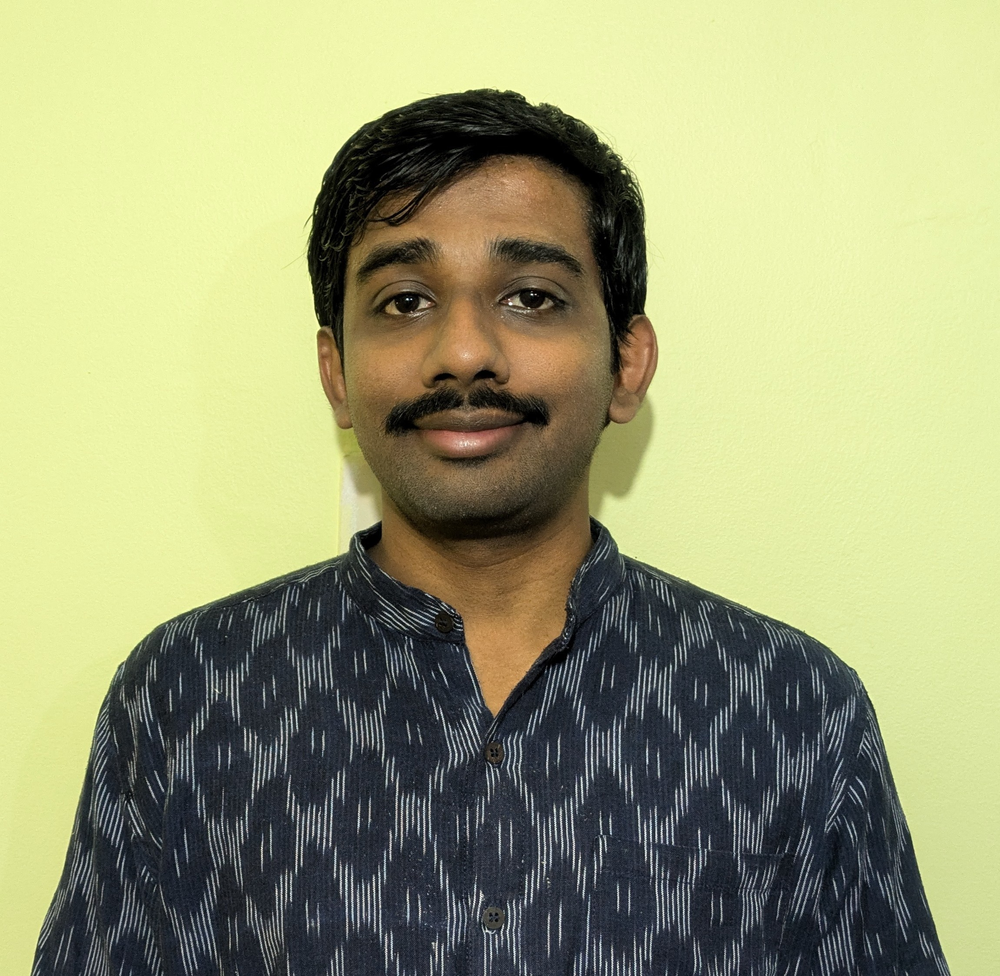
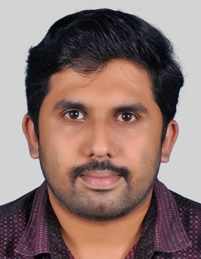
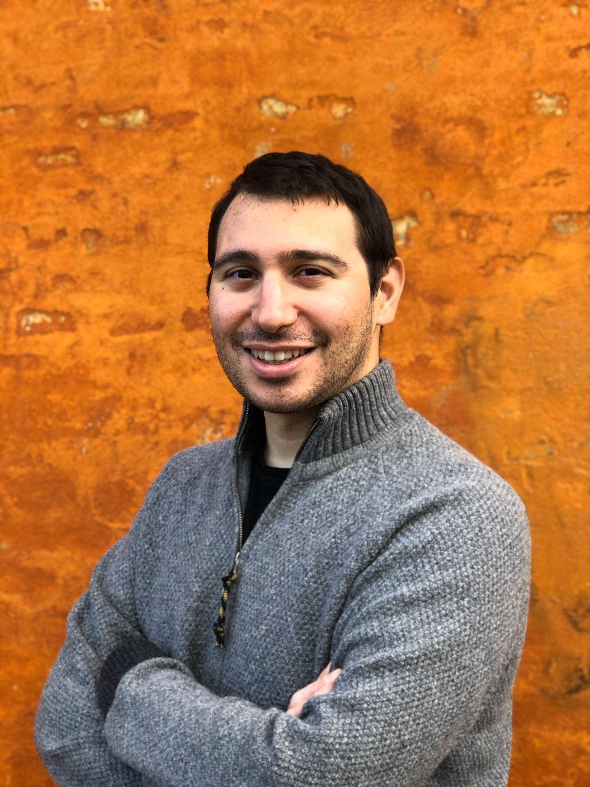
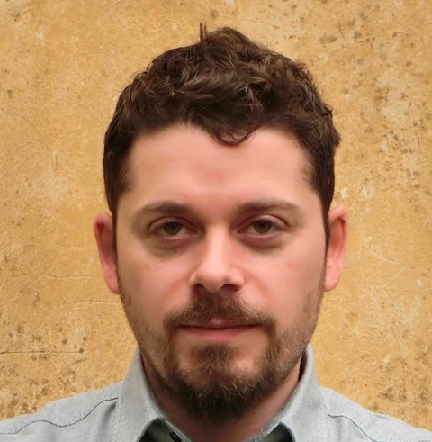
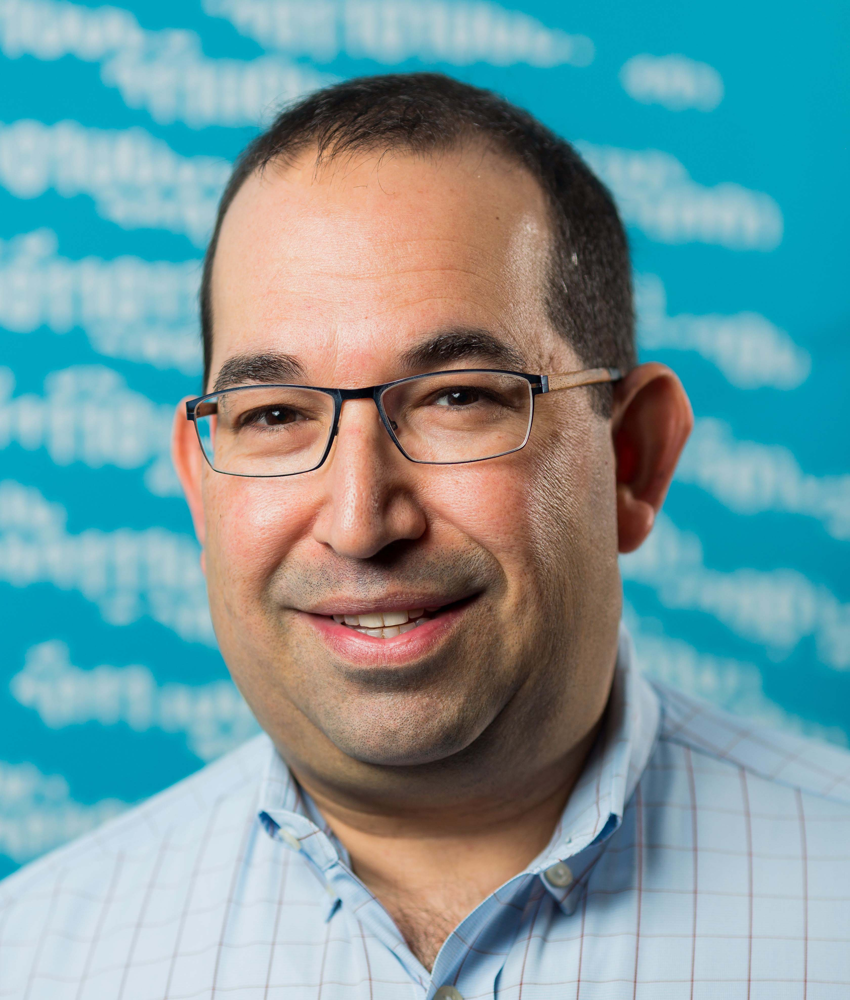

# CarbyneStackCon '24

   

_CarbyneStackCon_ is the annual gathering of the Carbyne Stack Open Source Community, designed to foster collaboration, discussion, and knowledge sharing on the latest advancements in secure multiparty computation (MPC).

---

## Registration

CarbyneStackCon '24 (CSC24) is an open event sponsored by Bosch Research, taking place on **November 27th (talks)** and **28th (workshops)**, 2024, in Renningen, Germany. This year’s theme is **enterprise-grade open MPC**. Seats for in-person attendance are limited, and registration is required.

!!! important "Use Event Code CSC24"
    Use the code **CSC24** to register on EventXP. Enter the code in the upper right on desktop, on iOS through a button at the top, and on Android via the hamburger menu.

!!! warning "Registration closes on November 20th, 2024."

<a href="https://register.event-xp.com" class="md-button md-button--primary">Register</a>

---
## Program
### Conference Day (Nov 27)

| Time                | Speaker                                        | Title                                                                                                |
|---------------------|------------------------------------------------|------------------------------------------------------------------------------------------------------|
| **8:30 am - 9:30 am** | -                                            | Registration & Welcome Coffee                                                                        |
| **9:30 am - 9:45 am** | Dr. Sven Trieflinger                          | [Welcome & Opening Remarks](#talk-1)                                                                 |
| **9:45 am - 10:15 am** | Dr. Marcel Keller                           | [Future Prospects of MP-SPDZ](#talk-2)                                                               |
| **10:15 am - 10:45 am** | Abhilash Venkatesh                         | [TEE-based Secure Computation and its Application to Carbyne Stack](#talk-3)                         |
| **10:45 am - 11:00 am** | -                                          | **Coffee Break**                                                                                     |
| **11:00 am - 11:30 am** | Dr. Ajith Suresh                           | [Revitalizing Privacy-Preserving Machine Learning: Introducing FANNG-MPC](#talk-4)                   |
| **11:30 am - 12:00 pm** | Kert Tali                                  | [Self-Service Deployment in MPC-as-a-Service](#talk-5)                                               |
| **12:00 pm - 1:00 pm** | -                                          | **Lunch Break & Group Photo**                                                                        |
| **1:00 pm - 1:30 pm** | Dr. Jonas Böhler                             | [Trees & Trade-offs for Secure Predictions](#talk-6)                                                 |
| **1:30 pm - 2:00 pm** | Dr. Christoph Bösch                          | [MPC as a Tool for Data Anonymization in Data Analytics](#talk-7)                                    |
| **2:00 pm - 2:30 pm** | Adrián Vaca Humanes; Daniele Romanini        | [Building a Privacy-First Ecosystem: SMPC in AdTech Analytics](#talk-8)                              |
| **2:30 pm - 3:00 pm** | Dr. Ian Zhou; Vincent Rieder                 | [Silentium: Low Communication & Hardware Acceleration for Beaver Triple Generation](#talk-9)         |
| **3:00 pm - 3:15 pm** | -                                           | **Coffee Break**                                                                                     |
| **3:15 pm - 3:45 pm** | Dr. Sven Trieflinger; Sebastian Becker; Dr. Benjamin Hettwer | [TBD](#talk-10)                                                   |
| **3:45 pm - 4:15 pm** | Dr. John Liagouris                           | [Integrating the BU Secure Analytics Stack with Carbyne](#talk-11)                                   |
| **4:15 pm - 4:45 pm** | Dr. Brian LaMacchia; Dr. Sven Trieflinger; Dr. Christian Hoeppler | [Open Source and MPC](#talk-12)                |
| **4:45 pm - 5:00 pm** | -                                           | Closing Remarks                                                                                      |

---
### Talk Details
---
:octicons-clock-16: 9:30 am - 9:45 am  
Welcome & Opening Remarks  
---
:octicons-clock-16: 9:45 am - 10:15 am  
Future Prospects of MP-SPDZ  

???+ info "Dr. Marcel Keller (Senior Research Scientist, CSIRO Data61)"

    

        
        
Marcel Keller is a senior research scientist with CSIRO's Data61, a research unit of Australia's national science agency. 
        After completing his PhD with Ivan Damgård at Aarhus University, he spent a few years at the University of Bristol under 
        the supervision of Nigel Smart. There, he started working on an implementation of multi-party computation that eventually 
        would form the basis of MP-SPDZ, an open-source project used by researchers all over the world.

    

???+ abstract "Abstract"

    MP-SPDZ is the leading open-source research prototype for multi-party computation, a major privacy-enhancing technology. 
    In this talk, I will present more recent developments in MP-SPDZ. On the protocol side, this includes secure shuffling, 
    which enables more efficient data analytics, and the switch to SoftSpokenOT, a more secure and flexible basis for scaling 
    two-party computation. In addition, I will cover MP-SPDZ's approach to scaling computation efficiently, which has been 
    inspired by HyCC (CCS'18).

---
:octicons-clock-16: 10:15 am - 10:45 am  
TEE based Secure Computation and its Application to Carbyne Stack  

???+ info "Abhilash Venkatesh (Lead Engineer, CDPG, IISc)"

    

        
        
Abhilash is a Lead Engineer at the Centre of Data for Public Good (CDPG), Foundation of Society (FSID), Innovation and 
        Development, IISc. He works primarily on container, cloud-based technologies and Secure Enclave, SMPC-based privacy-enhancing 
        technology (PET) at CDPG's research division. He loves Linux, computer networks, security, privacy, and anything related to 
        systems in general.

    

???+ abstract "Abstract"

    Trusted Execution Environment (TEE) is a hardware-based technology that provides data integrity, confidentiality, and code 
    integrity during data processing. Commonly used Multi-Party Computation (MPC) paradigms provide privacy-preserving computation 
    via two phases: an input-independent offline phase, which uses heavyweight cryptographic tools to generate cryptographic 
    randomness in advance, and a second online phase consisting of lightweight operations that consume this randomness. This talk 
    will cover the integration of TEE with MPC to securely accelerate the MPC offline phase in collaboration with Carbyne Stack. 
    The talk will also present the applications of TEEs to various privacy-enhancing use cases.

---
:octicons-clock-16: 10:45 am - 11:00 am  
:material-coffee: Coffee Break  
---
:octicons-clock-16: 11:00 am - 11:30 am  
Revitalizing Privacy-Preserving Machine Learning: Introducing FANNG-MPC for Actively Secure MLaaS  

???+ info "Dr. Ajith Suresh (Senior MPC Researcher, Technology Innovation Institute, Abu Dhabi)"

    

        
        
Ajith Suresh is a Senior MPC Researcher at the Technology Innovation Institute (TII) in Abu Dhabi, affiliated with the 
        Cryptography Research Center. Prior to joining TII, they completed 1.5 years of post-doctoral research at the Cryptography 
        and Privacy Engineering (ENCRYPTO) group at the Technical University of Darmstadt, under the supervision of Prof. Thomas 
        Schneider. They hold a PhD from the Indian Institute of Science Bangalore. Their research focuses on the design and development 
        of applied Multi-Party Computation (MPC) protocols, with additional interests in privacy-preserving machine learning and federated 
        learning.

    

???+ abstract "Abstract"

    In response to the reproducibility crisis in scientific research, we present FANNG-MPC, a versatile secure multi-party 
    computation (MPC) framework designed for privacy-preserving machine learning as a service. FANNG is a data-oriented fork of 
    the now-deprecated SCALE-MAMBA, featuring new libraries and instructions optimized for private neural networks. Key innovations 
    include decoupling offline and online phases, a software-based dealer model, and integrated database support. It also introduces 
    advanced protocols for garbled circuits, convolution operations, and private comparisons. This talk will explore FANNG’s design 
    challenges, solutions, and unresolved issues, with a focus on engaging CarbyneStackCon’s community to refine and extend FANNG’s 
    capabilities for privacy-preserving ML.

---
:octicons-clock-16: 11:30 am - 12:00 pm  
Self-Service Deployment of Computation Tasks in a Multi-Tenant MPC-as-a-Service  

???+ info "Kert Tali (Architect, Sharemind MPC Product Development, Cybernetica)"

    

        
        
Kert joined the Sharemind MPC product development team at Cybernetica in 2021 as a programmer. Fascinated by the engineering 
        challenges of MPC deployments, he began exploring ways to enhance the practicality of production-grade MPC. In 2022, Kert 
        defended his Master's thesis on scaling parallel algorithms on MPC. Shortly after, he set his sights on Carbyne Stack. Realizing 
        its immense potential for standardizing the way MPC is deployed, he spearheaded the initiative to integrate Sharemind MPC with 
        the Carbyne Stack platform. As the team grew around this shared ambition, he assumed the role of architect.

    

???+ abstract "Abstract"

    Employing MPC for cross-organizational data processing has well-established merits. Yet, the selection of technological solutions 
    that prioritize viability as much as security is limited. The UNECE Input Privacy Preservation Project assessed that servitisation 
    (i.e., MPC-as-a-Service) is key for the widespread adoption of MPC; however, it's not without critical design criteria to compete 
    with data sharing as the preferred method. Such a system would need to propose comprehensive processes and lightweight workflows— 
    accessible to non-technical users for securely and collaboratively organizing and executing MPC tasks. This talk expands on the 
    ongoing work in "JOCONDE," a project between Eurostat and Cybernetica to specify an MPCaaS system for use in official statistics. 
    We will explore how general-purpose MPC platforms like Carbyne Stack play a vital role in powering this system.
---
:octicons-clock-16: 12:00 pm - 1:00 pm  
:material-food: Lunch Break & Group Photo
---
:octicons-clock-16: 1:00 pm - 1:30 pm  
Trees & Trade-offs for Secure Predictions  

???+ info "Dr. Jonas Böhler (Lead AI Security & Privacy Researcher, SAP)"

    

        
        
Dr. Jonas Böhler is the lead AI security & privacy researcher for the SAP Foundation Model, SAP's table-native AI solution for 
        prediction tasks on tabular data. Previously, he was a senior researcher at SAP Security Research and also serves as SAP's 
        project lead for the EU project Glaciation, focusing on privacy-preserving collaborative learning. Jonas received his PhD 
        from the Karlsruhe Institute of Technology (KIT), where his thesis received awards from the ERCIM Security and Trust 
        Management Working Group and the KIT faculty of computer science. His research interests focus on privacy-enhancing 
        technologies with applications in cross-company collaborations.

    

???+ abstract "Abstract"

    Privacy-preserving edge-to-cloud data operations are central to the EU project Glaciation. SAP explores collaborative learning 
    across companies, empowered by Carbyne Stack’s cloud-native secure multi-party computation stack. For structured data, as 
    commonly found in industry settings, tree-based models offer simple, efficient, and often accurate prediction solutions. 
    However, secure multi-party training of tree-based models still incurs significant overhead. Fortunately, there exists a 
    spectrum between cloud-outsourced secure multi-party training and edge-local processing. This talk will delve into Glaciation’s 
    progress, discuss secure tree training, and examine various trade-offs considered to optimize the process.
---
:octicons-clock-16: 1:30 pm - 2:00 pm  
MPC as a Tool for Data Anonymization in Data Analytics: A Legal and Technical Perspective  

???+ info "Dr. Christoph Bösch (Research Engineer, Bosch Research)"

    *TBD*

???+ abstract "Abstract"

    *TBD*

---
:octicons-clock-16: 2:00 pm - 2:30 pm  
Building a Privacy-First Ecosystem: How SMPC is Transforming AdTech Analytics  

???+ info "Adrián Vaca Humanes (Engineering Lead, Resolve) and Daniele Romanini (Senior Privacy Engineer, Resolve)"

    

        
        
Adrián Vaca Humanes is the Engineering Lead at Resolve, focusing on Data Analytics and Cloud Architecture. 
        His experience spans various industries, including banking, consumer discretionary, and telecommunications. At Resolve, he is dedicated to 
        building privacy-preserving solutions for the AdTech industry, with a current focus on data engineering, platform optimization, 
        and cost reduction for products based on Secure Multi-Party Computation (SMPC).

    

    
    

        
        
Daniele Romanini is a Senior Privacy Engineer at Resolve, bringing expertise in both data science and software engineering. 
        His background includes experience in academia, government organizations, and the AdTech industry. Daniele is an advocate for 
        privacy-by-design and a privacy tech enthusiast, actively integrating privacy threat modeling and a privacy-first approach 
        into the software development lifecycle. He is currently focused on contributing to the development of a decentralized 
        measurement and analytics platform built with privacy-enhancing technologies at its core.

    

???+ abstract "Abstract"

    In a rapidly evolving landscape marked by growing user awareness of privacy and increasingly tightening privacy regulations, 
    the AdTech industry faces challenges to remain relevant and profitable. With increased attention to privacy-enhancing 
    technologies, including decentralized computation, Resolve is building decentralized programmatic advertising solutions that 
    emphasize privacy. Secure Multi-Party Computation (MPC) is a fundamental tool in Resolve's arsenal. Specifically, Resolve 
    leverages Carbyne Stack to construct a general-purpose collaborative analytics platform for the AdTech industry. This talk 
    will demonstrate how Carbyne Stack can be applied in programmatic advertising, detailing concrete use cases for collaborative 
    analytics. Additionally, the presentation will dive into technical aspects, addressing scalability and security challenges 
    encountered in real-world deployments.
---
:octicons-clock-16: 2:30 pm - 3:00 pm  
Silentium: Beaver Triple Generation with Low Communication and Hardware Acceleration  

???+ info "Dr. Ian Zhou (Research Engineer, UTS) and Vincent Rieder (PhD Student, Bosch Research)"

    

        
        
 Ian Zhou received his B.S. degree in computer science from The University of Sydney in 2016 and completed his M.B.A. and 
        Ph.D. degrees at the University of Technology Sydney in 2019 and 2023, respectively. His Ph.D. research focused on 
        machine learning-based frost monitoring systems. Currently, Dr. Zhou is a Research Engineer specializing in privacy-preserving 
        technologies, working on accelerating multi-party secure machine learning algorithms with CUDA and other GPU platforms. His 
        research interests include AI, IoT, cyber-physical systems, and blockchain.

    

    
    

        
        
 Vincent Rieder is a PhD student at Bosch Research in Renningen, focusing on Secure Multi-Party Computation (MPC). Holding a 
        Master’s degree in mathematics, his research centers on the algorithmic aspects of MPC. He aims to introduce new protocols 
        into the Carbyne Stack MPC cloud platform, specifically by optimizing and implementing an enhanced MPC offline phase for 
        generating Beaver triples using a Pseudorandom Correlation Generator (PCG) with low communication overhead, named Silentium.

    

???+ abstract "Abstract"

    The MPC framework of Carbyne Stack relies on the SPDZ protocol, where the most resource-intensive task is the generation of 
    Beaver triples in the offline phase. A recent advancement for offline phases, particularly relevant for the cloud context, 
    involves Pseudorandom Correlation Generators (PCGs) with reduced communication demands. This talk introduces Silentium, 
    a PCG implementation designed to generate Beaver triples with hardware acceleration. The first part of the presentation will 
    cover Silentium’s design principles, highlighting how this approach outperforms previous offline phases in MP-SPDZ. The second 
    part will focus on how further enhance Silentium’s local phase with a GPU-optimized Number Theoretic Transform for large 
    degrees. Altogether, this talk discusses how Silentium can enhance Klyshko, the offline phase engine of Carbyne Stack, potentially 
    offering significant cost savings in future applications.
---
:octicons-clock-16: 3:00 pm - 3:15 pm  
:material-coffee: Coffee Break  

---
:octicons-clock-16: 3:15 pm - 3:45 pm  

TBD  

???+ info "Dr. Sven Trieflinger(Senior Project Manager, Bosch Research), Sebastian Becker(Research Engineer, Bosch Research), and Dr. Benjamin Hettwer(Research Engineer, Bosch Research)"

    *TBD*

???+ abstract "Abstract"

    *TBD*

---
:octicons-clock-16: 3:45 pm - 4:15 pm  
:material-factory: Research Talk  

Integrating the BU Secure Analytics Stack with Carbyne  

???+ info "Dr. John Liagouris (Assistant Professor, Boston University)"

    

        
        
 John Liagouris is an assistant professor of Computer Science at Boston University, where he co-leads the Complex Analytics 
        and Scalable Processing research lab (CASP). He is a member of the Systems Group and is also affiliated with the Security 
        Group at BU. John's research focuses on distributed systems, cloud computing, security & privacy, and data management. 
        Prior to joining BU, he was a visiting scholar at the RISELab, UC Berkeley, a senior researcher at the Systems Group, ETH 
        Zurich, a visiting research fellow at the University of Hong Kong (HKU), and a research assistant at the “Athena” Research 
        Center in Greece. John earned his PhD from NTUA, Greece. His work has received several awards, including an “Outstanding 
        New Research Direction Award” at Usenix HotStorage 2020, a NSF SaTC Core Medium Award, a Bosch Research Award, and a Red 
        Hat Collaboratory Research Incubation Award.

    

???+ abstract "Abstract"

    In this talk, Dr. John Liagouris will present the latest developments in the BU secure analytics stack and its integration 
    with Carbyne. The BU stack is a novel software stack developed at Boston University to facilitate general-purpose analytics 
    using secure Multiparty Computation (MPC). Its current version supports both relational and time series computations on 
    millions of input records, with configurable semi-honest or malicious security settings. Built from scratch, the BU stack 
    encompasses efficient implementations of low-level MPC functionalities up through high-level operators and programming 
    abstractions. All stack layers, except the bottom one, are protocol-agnostic, employing a hierarchical and modular design 
    that maximizes reusability and extensibility. Improvements in any component of the stack can cascade across other parts, 
    enhancing overall functionality. This talk will delve into the BU stack's 4-year research journey, detailing the innovation 
    led by the Systems Group and Security Group at BU.

---
:octicons-clock-16: 4:15 pm - 4:45 pm  
Open Source and MPC  

???+ info "Dr. Brian LaMacchia (Executive Director, MPC Alliance), Dr. Sven Trieflinger (Senior Project Manager, Bosch Research), and Dr. Christian Hoeppler (TBD, Bosch Research)"

    

        
        
Brian LaMacchia is an applied cryptographer and currently the Executive Director of the MPC Alliance, a consortium of over 50 organizations promoting secure multi-party computation (MPC) technology. After a 25-year career at Microsoft Corporation, where he served as Distinguished Engineer for Cryptography and led the Security and Cryptography team at Microsoft Research, Brian retired in December 2022. He also co-founded and chaired the Microsoft Cryptography Review Board. Beyond his role at the MPC Alliance, Brian is an Adjunct Associate Professor at Indiana University-Bloomington’s School of Informatics and Computing, an Affiliate Faculty member at the University of Washington’s Department of Computer Science and Engineering, and an Advisor to Quantropi, Inc. Brian currently serves as Treasurer for the International Association for Cryptologic Research (IACR) and as Vice President on the Board of Directors of Seattle Opera. He earned his S.B., S.M., and Ph.D. degrees in Electrical Engineering and Computer Science from MIT in 1990, 1991, and 1996, respectively.

    

    *TBD*

???+ abstract "Abstract"

    *TBD*
---
:octicons-clock-16: 4:45 pm - 5:00 pm  
:material-factory: Closing Remarks  
---
### **Workshop Day: Interactive Format (Nov 28)**

   Focusing on hands-on technical sessions to deepen understanding of CarbyneStack’s open-source applications.

---
## Venue Information

- 
:octicons-location-16:{ .middle } Bosch Research Campus

    ---

    ![Bosch Research Campus][bosch-research-campus]

    

    **Address**

    Robert-Bosch-Campus 1  
    71272 Renningen, Germany

    [:octicons-arrow-right-24:{ .middle } Bosch Research website][bosch-research]

### Getting There

The Bosch Research Campus is located near Stuttgart. See our
[travel information sheet][bosch-research-campus-directions] for information
on how to get to the Research Campus by car or public transport.

---

## Accommodation

There are numerous hotels in and around Renningen. One within walking distance to the venue is:

[Hotel Campo][hotel-campo]  
Raitestraße 26  
71272 Renningen  
:material-phone: +49 7159 939800  
:material-email-outline: info@campo-renningen.de

---

## Catering

Food and beverages during the event will be complementary.

---

[bosch-research]: https://www.bosch.com/research/
[bosch-research-campus]: https://upload.wikimedia.org/wikipedia/commons/thumb/a/a0/BoschRenningen-pjt.jpg/1280px-BoschRenningen-pjt.jpg
[bosch-research-campus-directions]: rng_directions.pdf
[hotel-campo]: https://www.campo-renningen.de/en
